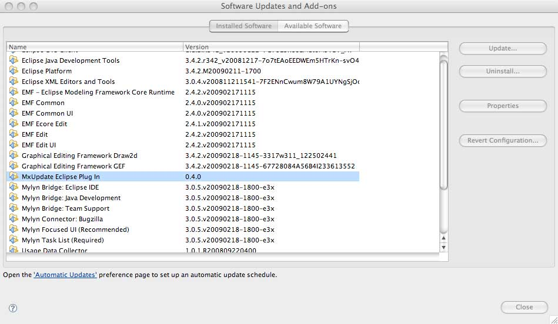

<!--
 *
 *  This file is part of MxUpdate <http://www.mxupdate.org>.
 *
 *  MxUpdate is a deployment tool for a PLM platform to handle
 *  administration objects as single update files (configuration item).
 *
 *  Copyright (C) 2008-2016 The MxUpdate Team
 *
 *  The Manual of MxUpdate is licensed under a CC BY-NC-SA 4.0 license
 *  (Creative Commons Attribution-NonCommercial-ShareAlike 4.0 
 *  International 4.0 license).
 *
 *  You should have received a copy of the license along with this
 *  work. If not, see <http://creativecommons.org/licenses/by-nc-sa/4.0/>.
 *
-->

#Check installed MxUpdate Eclipse Plug-In

From the Help Menu of Eclipse the "Software Updates..." must be selected. The the new windows shows the already installed plug-ins (including the new MxUpdate Eclipse Plug-In):

