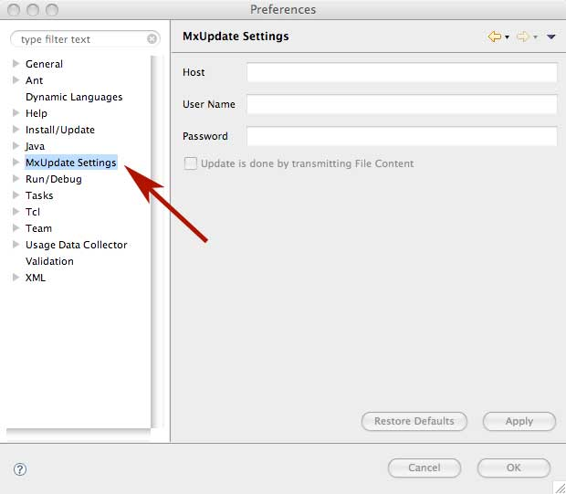
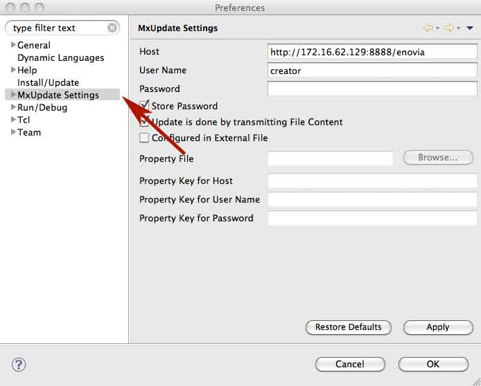
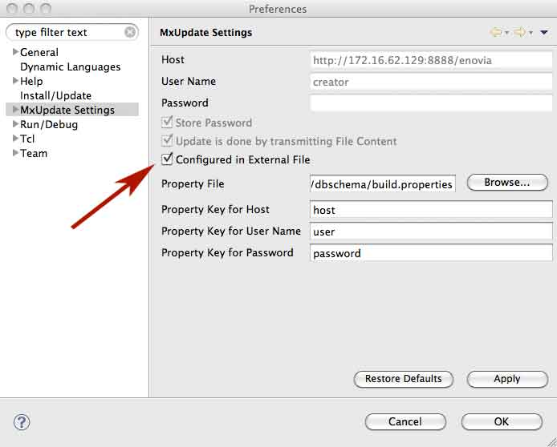
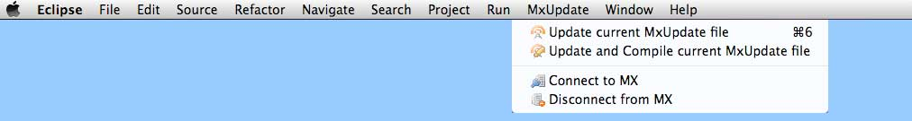
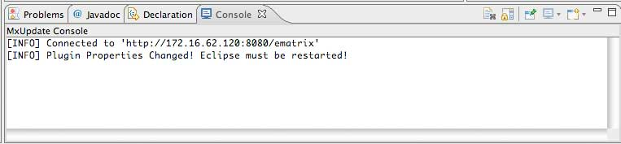
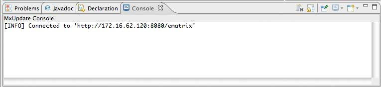

<!--
 *
 *  This file is part of MxUpdate <http://www.mxupdate.org>.
 *
 *  MxUpdate is a deployment tool for a PLM platform to handle
 *  administration objects as single update files (configuration item).
 *
 *  Copyright (C) 2008-2016 The MxUpdate Team
 *
 *  The Manual of MxUpdate is licensed under a CC BY-NC-SA 4.0 license
 *  (Creative Commons Attribution-NonCommercial-ShareAlike 4.0 
 *  International 4.0 license).
 *
 *  You should have received a copy of the license along with this
 *  work. If not, see <http://creativecommons.org/licenses/by-nc-sa/4.0/>.
 *
-->

#Connect to MX

##Configure Connection

###Open Preference Page



###Enter Connection Information



Two configuration are possible:
* The connection information could be defined directly.
* Or the connection information could be defined in an external property file by selecting "Configured in External File".



###Connect to MX



The MxUpdate Console is automatically opened and shows a successful connect:



###Restart Eclipse
Because the MxUpdate Eclipse Plug-In always loads the current configuration from the installed MxUpdate Update Deployment tool, Eclipse must be restarted. A restart is always needed if the configuration of MxUpdate Update Deployment tool is changed (in this case a message is shown to the user in the console).

After Eclipse is restarted a connected again following message should be shown in the console:



----
##Internal Connection Settings

###Host
The Host defines the URL to the MX server.
* If no value is entered, the MX ADK loads the shared library of the kernel directly in the same Java VM of Eclipse.
* If the URL of the host starts with `http` or `https` then the MxUpdate Eclipse Plug-In connects to the MX web application server. The root directory of the deployed application must be entered.
* Also a RMI server could be defined. Then the URL must start with `rmi`.

For for information see also the ADK documentation of Enovia PLM.

###User Name
The name of a user must be entered. The user *must* have business administration access! After first installation e.g. the user "creator" have this access.

###Password
The password of the defined user must be specified. If the user has no password, no value must be entered.

###Flag "Store Password"
If the flag is not set, an windows is opened where the user and password must be entered. Otherwise the user and password could be defined directly in the preferences.

###Flag "Update is done by transmitting File Content"
If you are connection to MX on another computer, e.g. inside a virtual machine, then you could select the flag "Update is done by transmitting File Content". This means that the content of an update file is also transmitted to the server. The server writes the file content to temporary files and runs the update.

The flag must not selected if the MX application server (defined by the host) could reach the update files with the same path. Especially if no host is host is defined and the MX kernel runs directly in the Java VM of Eclipse.

----
##External Connection Settings
If the flag "Configured in External File" is set, an external property file could be defined where the configuration for the connection is set.

###Property File
Defines the absolute path of the name for the property file.

###Property Key for Host
Defines the key name for the host in the external property file.

###Property Key for User Name
Defines the key name for the user name in the external property file.

If no property key for the user name is defined, a dialog will be opened while connecting where the user and password must be entered.

###Property Key for Password
Defines the key name for the password in the external property file.

If no property key for the password is defined, a dialog will be opened while connecting where the user and password must be entered.

###Example
The Property Key for the host is set to "`host`", for the user name
"`user`"  and for the password "`password`".
```
host=http://172.16.62.129:8888/enovia
user=creator
password=
```
