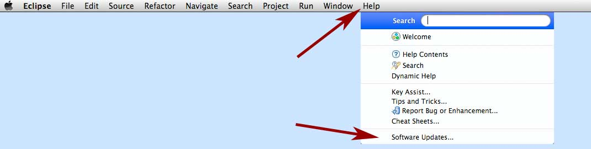
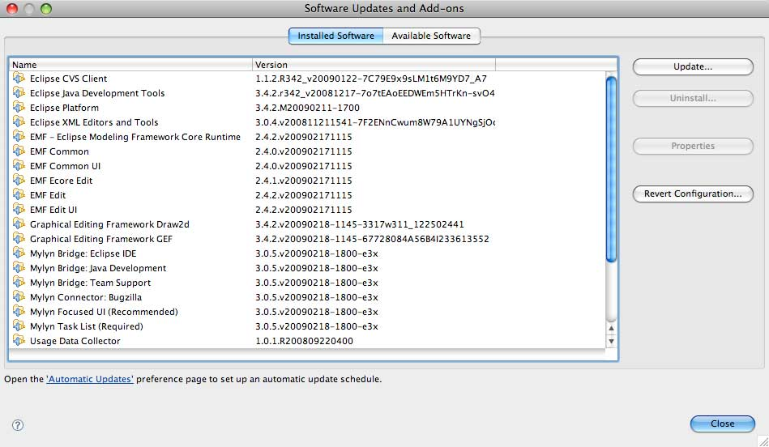
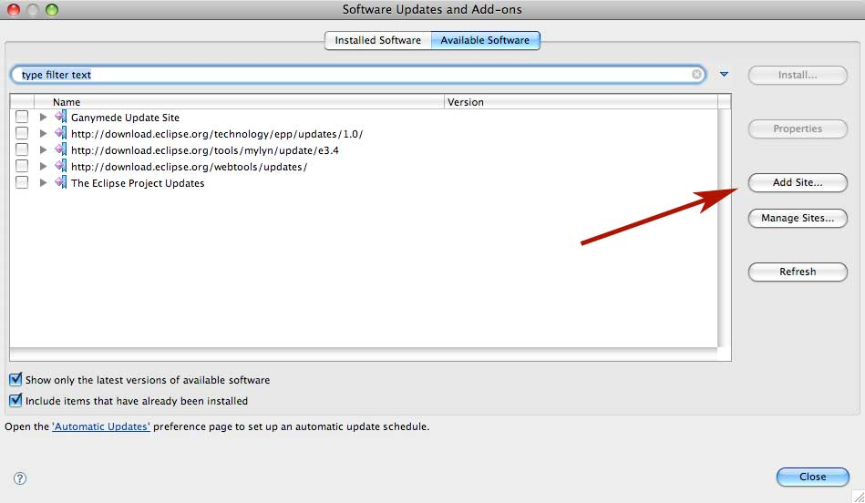
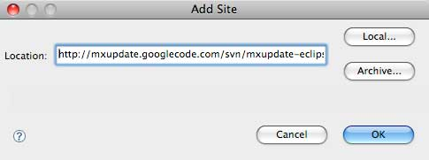
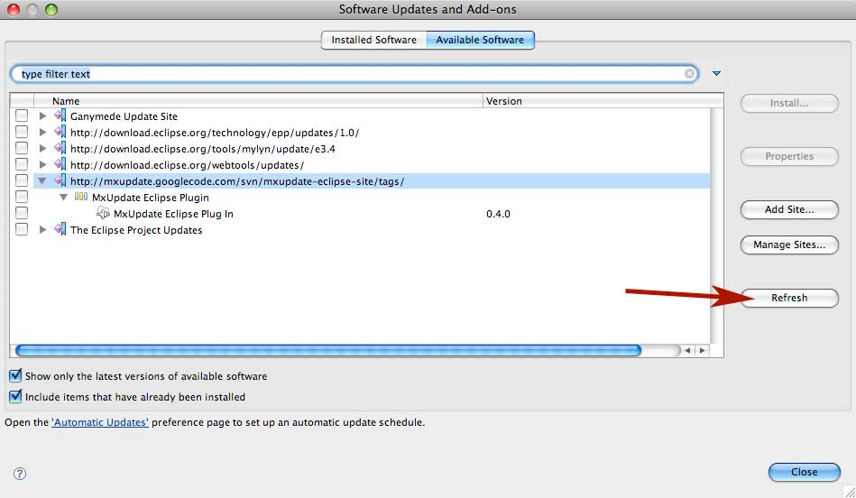
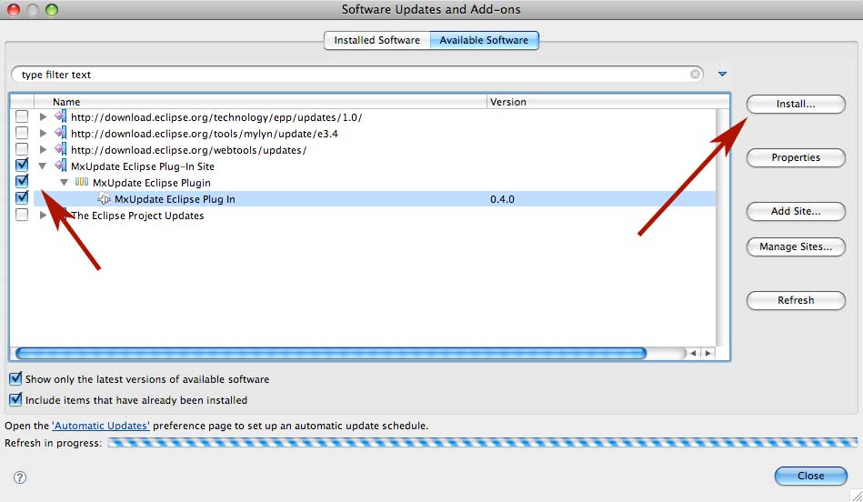
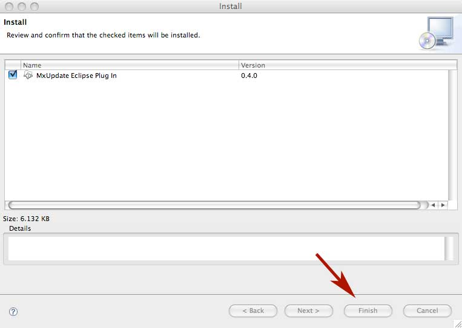
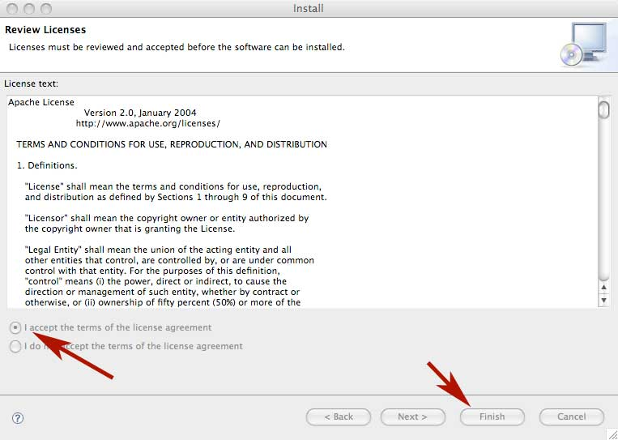
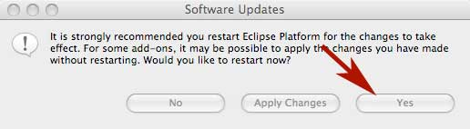

<!--
 *
 *  This file is part of MxUpdate <http://www.mxupdate.org>.
 *
 *  MxUpdate is a deployment tool for a PLM platform to handle
 *  administration objects as single update files (configuration item).
 *
 *  Copyright (C) 2008-2016 The MxUpdate Team
 *
 *  The Manual of MxUpdate is licensed under a CC BY-NC-SA 4.0 license
 *  (Creative Commons Attribution-NonCommercial-ShareAlike 4.0 
 *  International 4.0 license).
 *
 *  You should have received a copy of the license along with this
 *  work. If not, see <http://creativecommons.org/licenses/by-nc-sa/4.0/>.
 *
-->

#Installation of the MxUpdate Eclipse Plug-In

---
##Introduction
The installation of the !MxUpdate Eclipse Plug-In could be done by using the [MxUpdate Eclipse Plug-In site](http://mxupdate.googlecode.com/svn/mxupdate-eclipse-site/tags/). [The MX ADK Plug-In must be already installed](EclipseInstallation_ADK). Alternative the MxUpdate Eclipse Plug-In could be also installed [manually](EclipseInstallation_Manually.md).

---
###Installation with the MxUpdate Eclipse Plug-In Site

###Call Software Update
From the Help Menu of Eclipse select "Software Updates":

###Select Available Software
Press the "Available Software" Tab in the new opened window:

###Add new Site
Press the "Add Site" button on the right site of the window:

A new windows pop ups. The new site http://mxupdate.googlecode.com/svn/mxupdate-eclipse-site/tags/ for the MxUpdate Eclipse Plug-In must be entered:

###Refresh Sites

###Select and Install

###Confirm Installation

###Accept License

###Restart Eclipse

