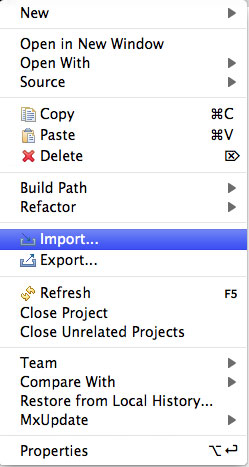
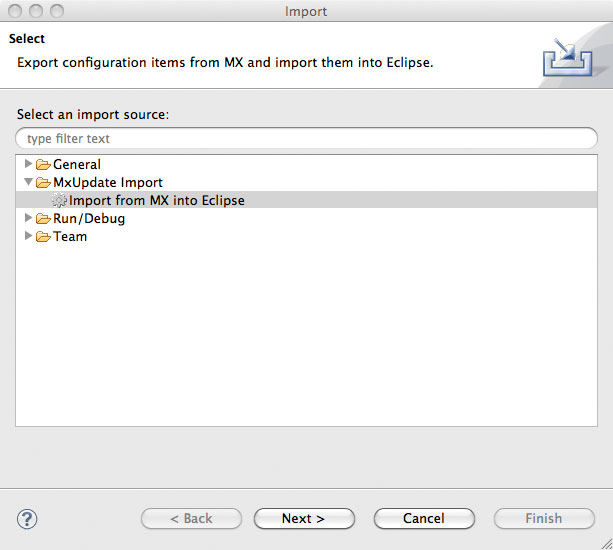
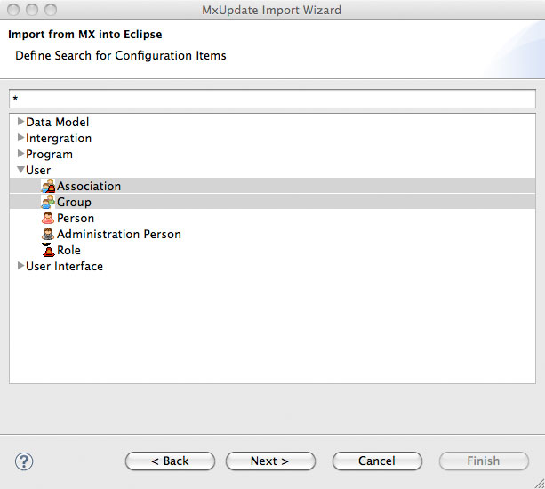
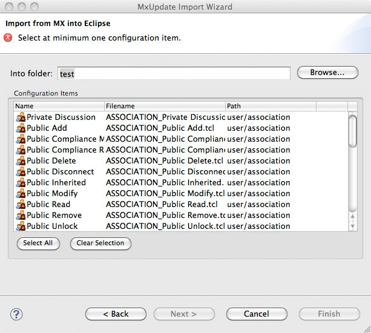
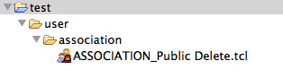

<!--
 *
 *  This file is part of MxUpdate <http://www.mxupdate.org>.
 *
 *  MxUpdate is a deployment tool for a PLM platform to handle
 *  administration objects as single update files (configuration item).
 *
 *  Copyright (C) 2008-2016 The MxUpdate Team
 *
 *  The Manual of MxUpdate is licensed under a CC BY-NC-SA 4.0 license
 *  (Creative Commons Attribution-NonCommercial-ShareAlike 4.0 
 *  International 4.0 license).
 *
 *  You should have received a copy of the license along with this
 *  work. If not, see <http://creativecommons.org/licenses/by-nc-sa/4.0/>.
 *
-->

#Usage of the MxUpdate Eclipse Plug-In

----
##Import Configuration Items from MX
This is a step-by-step description how to import within Eclipse configuration
items directly from MX without any MQL console.

*   In the explorer click the right mouse click and select the "Import" command.
    
    The import wizard opens.
*   Select from the "MxUpdate Import" category the "Import from MX into Eclipse" import.
    
    After pressing the next button the list of all possible type definitions is shown.
*   Define in the first field the wild card for search configuration items.
*   Select the type definitions.
    
*   Press button "Next".
    The found configuration items are shown.
*   Select the folder in which the configuration items are imported.
*   Select the configuration items to import.
    
*   Press button "Next".
    The select configuration items are imported.
    
